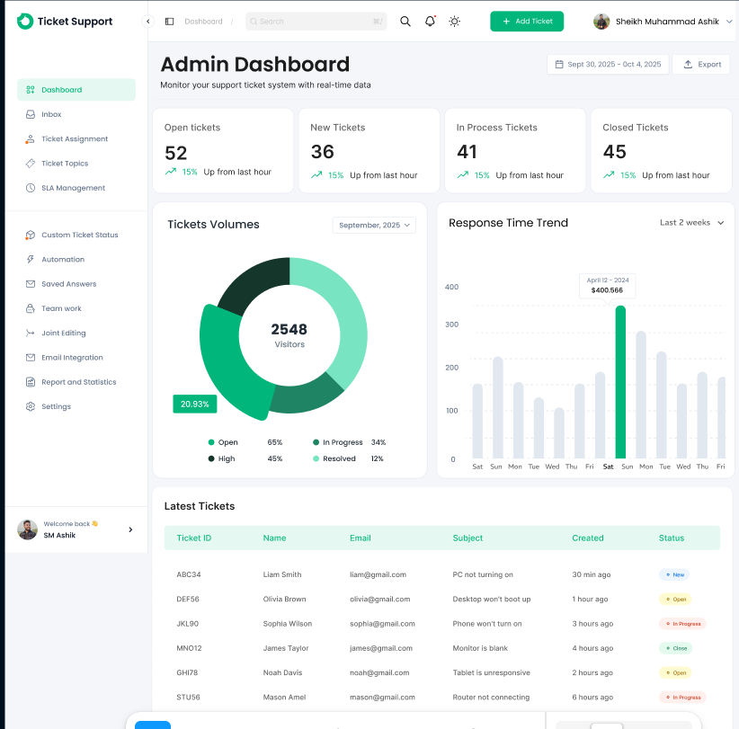
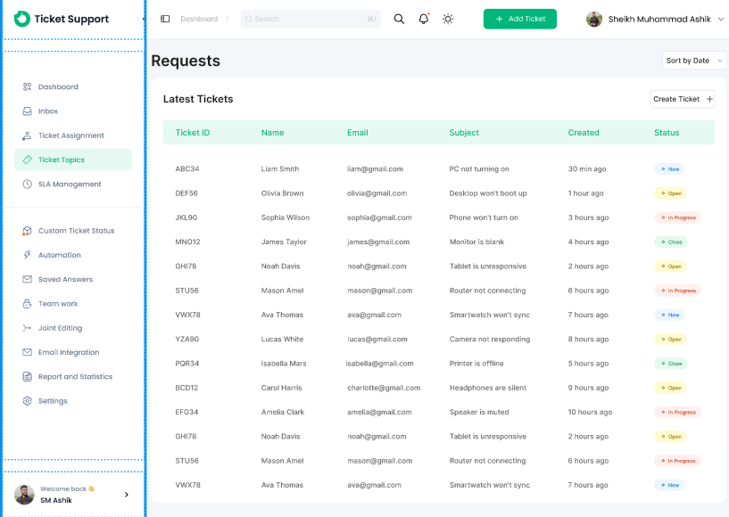

# Central de Chamados (Help Desk)

[](https://github.com/PedroBLS/helpdesk-chamados/actions/workflows/ci.yml)

Front-end de um sistema de chamados de suporte de TI, com painel de indicadores, lista filtrável, detalhe do chamado com **SLA** e formulário de abertura. Feito em **React + TypeScript (Next.js)** e **Tailwind CSS**, responsivo do celular ao desktop, a partir de um layout do Figma.

**[▶ Ver online](https://helpdesk-chamados.vercel.app)** (abra também no celular)

## Do layout à interface

O ponto de partida foi o layout [Dashboard Ticket Support](https://www.figma.com/community/file/1555578819353496902/dashboard-ticket-support), de **Sheikh Muhammad Ashik** (licença [CC BY 4.0](https://creativecommons.org/licenses/by/4.0/)). Reaproveitei a paleta de verdes, a fonte Poppins, os cartões de indicadores, a rosca, as barras e a tabela com status coloridos, e adaptei tudo para português e para dados de suporte.

| Layout original (Figma) | O que foi feito |
|---|---|
|  | Painel com indicadores de fila e SLA, chamados por status e por categoria, e últimos chamados |
|  | Lista de chamados com filtro por status (pela URL, `?status=`) e SLA de cada chamado |

**O que não existia no layout e foi desenhado no mesmo estilo:**
- **Versão para celular:** o menu lateral vira um menu que abre pelo botão ☰, e a tabela vira cartões.
- **Detalhe do chamado:** descrição, prioridade, nível (N1/N2), responsável e prazo do SLA.
- **Formulário de novo chamado:** validação campo a campo, mensagens de erro ligadas aos campos (`aria-invalid` e `aria-describedby`) para leitores de tela.

## Regra de SLA

O prazo de resolução depende da prioridade (urgente 4 h, alta 8 h, média 24 h, baixa 48 h). Em `src/lib/sla.ts`, cada chamado fica:
- **no prazo**;
- **em risco**, quando já consumiu 80% do prazo;
- **estourado**, quando passou do prazo sem solução;
- **cumprido**, quando foi resolvido dentro do prazo.

## Decisões

- **Gráficos só com CSS** (`conic-gradient` na rosca, barras com altura proporcional), sem biblioteca: são dois gráficos simples.
- **Filtro pela URL** em vez de estado no navegador: o link filtrado pode ser compartilhado e a página funciona sem JavaScript.
- **Dados simulados** em `src/lib/chamados.ts`, com datas relativas ao momento do acesso, para o SLA aparecer realista. A próxima etapa é o backend: API, PostgreSQL e login.

## Como executar

```bash
npm install
npm run dev     # http://localhost:3000
npm test        # 12 testes: regra de SLA, validação e formulário
npm run build
```

A cada push, o GitHub Actions roda lint, testes e build.

## Tecnologias

React 19, Next.js 16 (App Router), TypeScript, Tailwind CSS 4, Vitest e Testing Library, GitHub Actions.

Desenvolvido por Pedro Brandão Leal dos Santos, com apoio do **Claude Code** na escrita do código. Layout base de Sheikh Muhammad Ashik (CC BY 4.0).
